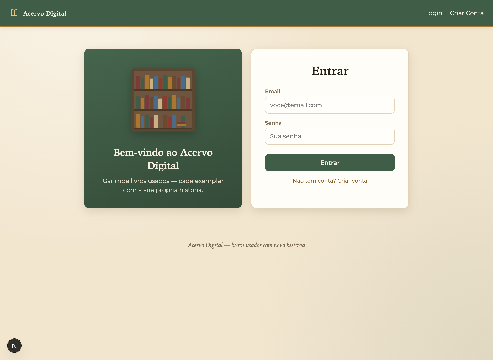

# Acervo Digital - Backend

Backend do projeto Acervo Digital, desenvolvido para a disciplina XDES03 - Programação Web.

O sistema permite autenticar usuários, gerenciar livros de um catálogo e registrar compras simbólicas de livros disponíveis.

## Tecnologias

- Node.js
- Express
- TypeScript
- Prisma
- SQLite
- bcrypt
- jsonwebtoken
- cookie-parser
- cors

## Funcionalidades

- Cadastro de usuário comum
- Login com JWT salvo em cookie HttpOnly
- Logout
- Rotas privadas com middleware de autenticação
- Perfil ADMIN e USER
- CRUD de livros para ADMIN
- Listagem de livros para usuários logados
- Compra simbólica de livros por USER
- Busca de livros na Open Library

## Screenshots

Telas da aplicação (frontend) que consome esta API:

### Tela de login


### Catálogo (visão do administrador)


### Catálogo (visão do usuário)


## Regras principais

- O cadastro público sempre cria usuário USER.
- O usuário ADMIN é criado previamente pelo seed.
- Cada livro representa um exemplar físico único.
- Livro não possui quantidade ou estoque.
- Livro comprado fica indisponível.
- Livro indisponível continua no catálogo.
- Apenas ADMIN pode cadastrar, editar, excluir e alterar status de livros.
- Apenas USER pode comprar livros disponíveis.

## Como executar

Instale as dependências:

```bash
npm install
```

Crie o arquivo `.env` com base no `.env.example`:

```env
DATABASE_URL="file:./app.db"
JWT_SECRET="coloque-um-segredo-aqui"
```

Crie o banco SQLite:

```bash
npx prisma db push
```

Caso o Prisma apresente erro ao criar o banco SQLite, crie o arquivo vazio antes:

```bash
New-Item -ItemType File -Path "prisma/app.db" -Force
npx prisma db push
```

Crie o usuário administrador:

```bash
npm run seed
```

Execute o servidor:

```bash
npm run dev
```

O backend ficará disponível em:

```txt
http://localhost:3001
```

## Usuário administrador

```txt
email: admin@acervodigital.com
senha: admin123
```

## Rotas principais

### Auth

- `POST /auth/create`
- `POST /auth/login`
- `POST /auth/logout`
- `GET /auth/me`

### Livros

- `GET /livros`
- `GET /livros/:id`
- `POST /livros`
- `PUT /livros/:id`
- `DELETE /livros/:id`

### Compras

- `POST /compras`
- `GET /compras`

### Open Library

- `GET /open-library/search?q=nome-do-livro`

## Observação

Este projeto foi desenvolvido seguindo a estrutura simples das aulas de backend com Express, Prisma e autenticação JWT.

## Integrantes

- **Thaís de Souza** — [github.com/thais-souza311](https://github.com/thais-souza311)
- **Gustavo Raponi** — [github.com/rapon1kt](https://github.com/rapon1kt)
